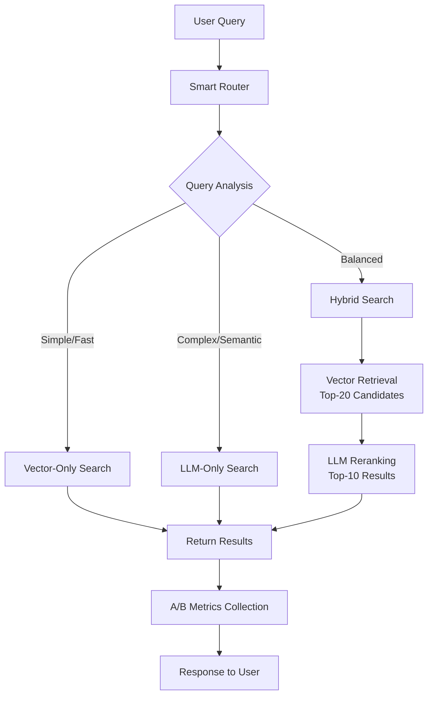

# Piano Implementazione: Approccio Ibrido Vector + LLM

**Data Creazione**: 2026-01-09
**Ultima Modifica**: 2026-01-09
**Status**: 🟡 In Corso - Fase 4 Roadmap
**Obiettivo**: Implementare sistema di ricerca ibrido Vector + LLM con smart routing

---

## Overview

Implementazione dell'approccio ibrido come **ponte** tra il sistema vector attuale e il target LLM-first, mantenendo i benefici di entrambi:

- **Vector Search**: Velocità, recall alto, deterministico
- **LLM Reranking**: Precision semantica, reasoning, domain expertise
- **Smart Routing**: Selezione automatica strategia ottimale per query

---

## Architettura Ibrida

### Flow Diagram



### Component Design

```python
class HybridSearchEngine:
    def __init__(self):
        self.vector_searcher = VectorSearcher()
        self.llm_searcher = LLMSearcher()
        self.smart_router = SmartRouter()
        self.metrics_collector = MetricsCollector()

    def search(self, query: str, metadata: dict) -> SearchResult:
        """Entry point for hybrid search with automatic strategy selection"""
        strategy = self.smart_router.select_strategy(query, metadata)

        if strategy == SearchStrategy.VECTOR_ONLY:
            result = self._vector_search(query)
        elif strategy == SearchStrategy.LLM_ONLY:
            result = self._llm_search(query)
        elif strategy == SearchStrategy.HYBRID:
            result = self._hybrid_search(query)

        self.metrics_collector.track(query, strategy, result)
        return result
```

---

## STEP 1: Smart Router Implementation

### 1.1 Query Analysis Engine

**File**: `tools/hybrid_search/query_analyzer.py`

```python
import re
from typing import Dict, List
from dataclasses import dataclass

@dataclass
class QueryAnalysis:
    complexity_score: float      # 0-1, higher = more complex
    domain_terms: List[str]      # Veterinary terms detected
    semantic_indicators: List[str] # Words suggesting semantic search needed
    length_score: float          # Based on word count
    entity_count: int            # Number of domain entities

class QueryAnalyzer:
    def __init__(self):
        self.veterinary_terms = self._load_veterinary_terms()
        self.semantic_indicators = [
            "riguardano", "relativo", "correlato", "connesso",
            "simile", "tipo", "categoria", "genere",
            "benessere", "sicurezza", "qualità", "controllo"
        ]
        self.complexity_patterns = [
            r"che\s+(riguardano|trattano|parlano)",  # Relative clauses
            r"per\s+quanto\s+riguarda",             # Complex prepositional
            r"nell'ambito\s+di",                    # Domain-specific
            r"in\s+materia\s+di"                   # Technical context
        ]

    def analyze(self, query: str) -> QueryAnalysis:
        """Comprehensive query analysis for routing decision"""
        query_lower = query.lower()
        words = query_lower.split()

        # Complexity scoring
        complexity_score = self._calculate_complexity(query_lower, words)

        # Domain terms detection
        domain_terms = [term for term in self.veterinary_terms if term in query_lower]

        # Semantic indicators
        semantic_indicators = [ind for ind in self.semantic_indicators if ind in query_lower]

        # Length scoring (longer queries = more semantic)
        length_score = min(len(words) / 10.0, 1.0)  # Normalize to 0-1

        return QueryAnalysis(
            complexity_score=complexity_score,
            domain_terms=domain_terms,
            semantic_indicators=semantic_indicators,
            length_score=length_score,
            entity_count=len(domain_terms)
        )

    def _calculate_complexity(self, query: str, words: List[str]) -> float:
        """Calculate query complexity score"""
        score = 0.0

        # Pattern-based complexity
        for pattern in self.complexity_patterns:
            if re.search(pattern, query):
                score += 0.3

        # Word count complexity
        if len(words) > 7:
            score += 0.2
        elif len(words) > 4:
            score += 0.1

        # Question words (often need semantic understanding)
        question_words = ["quali", "che", "come", "dove", "quando", "perché"]
        if any(word in words for word in question_words):
            score += 0.2

        # Semantic relationship words
        relationship_words = ["correlato", "simile", "riguardante", "relativo"]
        if any(word in query for word in relationship_words):
            score += 0.3

        return min(score, 1.0)  # Cap at 1.0
```

### 1.2 Smart Routing Logic

**File**: `tools/hybrid_search/smart_router.py`

```python
from enum import Enum
from typing import Dict, Any
from dataclasses import dataclass

class SearchStrategy(Enum):
    VECTOR_ONLY = "vector_only"
    LLM_ONLY = "llm_only"
    HYBRID = "hybrid"

@dataclass
class RoutingConfig:
    # Thresholds for strategy selection
    complexity_threshold_high: float = 0.7  # Above = LLM only
    complexity_threshold_low: float = 0.3   # Below = Vector only

    # Performance constraints
    max_latency_ms: int = 3000
    max_tokens_per_query: int = 800

    # Quality constraints
    min_confidence_vector: float = 0.6
    min_confidence_llm: float = 0.8

class SmartRouter:
    def __init__(self, config: RoutingConfig = None):
        self.config = config or RoutingConfig()
        self.query_analyzer = QueryAnalyzer()
        self.performance_tracker = PerformanceTracker()

    def select_strategy(self, query: str, metadata: dict = None) -> SearchStrategy:
        """Select optimal search strategy based on query analysis"""

        analysis = self.query_analyzer.analyze(query)

        # Rule-based routing
        strategy = self._apply_routing_rules(analysis, metadata)

        # Performance-based adjustments
        strategy = self._adjust_for_performance(strategy, metadata)

        return strategy

    def _apply_routing_rules(self, analysis: QueryAnalysis, metadata: dict) -> SearchStrategy:
        """Core routing logic based on query analysis"""

        # Rule 1: High complexity → LLM only
        if analysis.complexity_score > self.config.complexity_threshold_high:
            return SearchStrategy.LLM_ONLY

        # Rule 2: Low complexity + simple terms → Vector only
        if (analysis.complexity_score < self.config.complexity_threshold_low
            and len(analysis.semantic_indicators) == 0):
            return SearchStrategy.VECTOR_ONLY

        # Rule 3: Specific domain terms with semantic indicators → Hybrid
        if (len(analysis.domain_terms) > 0
            and len(analysis.semantic_indicators) > 0):
            return SearchStrategy.HYBRID

        # Rule 4: Long queries with domain context → Hybrid
        if analysis.length_score > 0.6 and analysis.entity_count > 1:
            return SearchStrategy.HYBRID

        # Rule 5: Simple exact matches → Vector only
        if self._is_exact_match_query(analysis):
            return SearchStrategy.VECTOR_ONLY

        # Default: Hybrid (conservative choice)
        return SearchStrategy.HYBRID

    def _adjust_for_performance(self, strategy: SearchStrategy, metadata: dict) -> SearchStrategy:
        """Adjust strategy based on performance constraints"""

        # Get current system load
        current_load = self.performance_tracker.get_current_load()

        # Under high load, prefer faster strategies
        if current_load > 0.8:
            if strategy == SearchStrategy.LLM_ONLY:
                return SearchStrategy.HYBRID  # Downgrade for performance

        # User-specific preferences
        if metadata and metadata.get("prefer_fast", False):
            if strategy == SearchStrategy.LLM_ONLY:
                return SearchStrategy.HYBRID

        return strategy

    def _is_exact_match_query(self, analysis: QueryAnalysis) -> bool:
        """Detect if query is likely exact match (piano code, etc.)"""
        query_patterns = [
            r"^[A-Z]\d+$",        # Piano codes like A1, B23
            r"piano\s+[A-Z]\d+",  # "piano A1"
            r"^[A-Z]\d+[_-]\w+$"  # Compound codes like A1_F
        ]

        # Implementation would check patterns
        return False  # Simplified for now
```

---

## STEP 2: LLM Reranking Engine

### 2.1 Context-Optimized LLM Reranker

**File**: `tools/hybrid_search/llm_reranker.py`

```python
from typing import List, Dict, Any
import json

class LLMReranker:
    def __init__(self, llm_client):
        self.llm_client = llm_client
        self.reranking_prompt = self._build_reranking_prompt()

    def rerank_candidates(self, query: str, candidates: List[Dict],
                         top_k: int = 10) -> List[Dict]:
        """Rerank vector candidates using LLM semantic understanding"""

        if len(candidates) <= top_k:
            # Already few enough, just add LLM confidence scores
            return self._add_confidence_scores(query, candidates)

        # Context optimization for large candidate lists
        context = self._optimize_candidates_context(candidates)

        # Build reranking prompt
        prompt = self._build_reranking_prompt(query, context, top_k)

        try:
            # LLM reranking
            response = self.llm_client.generate(
                prompt=prompt,
                temperature=0.1,  # Low temperature for consistent ranking
                max_tokens=500
            )

            # Parse and apply reranking
            reranked_aliases = self._parse_reranking_response(response)
            reranked_results = self._apply_reranking(candidates, reranked_aliases)

            return reranked_results[:top_k]

        except Exception as e:
            print(f"❌ LLM reranking failed: {e}, using vector order")
            return candidates[:top_k]

    def _build_reranking_prompt(self, query: str, context: str, top_k: int) -> str:
        """Build optimized prompt for LLM reranking"""

        return f"""Sei un esperto del sistema di monitoraggio veterinario della Regione Campania.

QUERY OPERATORE: "{query}"

Riordina i seguenti piani per RILEVANZA SEMANTICA rispetto alla query:

{context}

CRITERI DI RANKING:
1. Rilevanza semantica diretta alla query
2. Comprensione del dominio veterinario
3. Intent dell'operatore ASL
4. Correlazioni concettuali (non solo keyword)

RISPOSTA (JSON):
{{
    "reasoning": "breve spiegazione della logica di ranking",
    "reranked_plans": [
        {{"alias": "A1", "confidence": 0.95, "rationale": "motivo"}},
        {{"alias": "B2", "confidence": 0.87, "rationale": "motivo"}},
        // ... massimo {top_k} piani
    ]
}}

Ordina per rilevanza decrescente. Includi solo i {top_k} più rilevanti."""

    def _optimize_candidates_context(self, candidates: List[Dict]) -> str:
        """Optimize context representation for token efficiency"""

        context_lines = []
        for i, candidate in enumerate(candidates):
            # Compact representation
            alias = candidate.get('alias', f'Plan_{i}')
            desc = candidate.get('descrizione', '')
            desc2 = candidate.get('descrizione_2', '')

            # Combine descriptions efficiently
            full_desc = f"{desc} {desc2}".strip()
            if len(full_desc) > 80:
                full_desc = full_desc[:77] + "..."

            # Vector score as additional context
            vector_score = candidate.get('similarity', 0.0)

            context_lines.append(f"• {alias}: {full_desc} (vector: {vector_score:.2f})")

        return "\n".join(context_lines)

    def _parse_reranking_response(self, response: str) -> List[str]:
        """Parse LLM reranking response and extract ordered aliases"""

        try:
            # Extract JSON from response
            json_start = response.find('{')
            json_end = response.rfind('}') + 1
            json_str = response[json_start:json_end]

            parsed = json.loads(json_str)

            # Extract ordered aliases
            reranked_plans = parsed.get('reranked_plans', [])
            return [plan['alias'] for plan in reranked_plans]

        except Exception as e:
            print(f"⚠️  Failed to parse LLM reranking: {e}")
            # Fallback: return empty list (will use original order)
            return []

    def _apply_reranking(self, candidates: List[Dict],
                        reranked_aliases: List[str]) -> List[Dict]:
        """Apply LLM ranking to candidate list"""

        if not reranked_aliases:
            return candidates  # Use original order if parsing failed

        # Create mapping alias -> candidate
        candidates_map = {c.get('alias'): c for c in candidates}

        # Build reranked list
        reranked = []
        used_aliases = set()

        # First: add candidates in LLM-specified order
        for alias in reranked_aliases:
            if alias in candidates_map and alias not in used_aliases:
                reranked.append(candidates_map[alias])
                used_aliases.add(alias)

        # Add any remaining candidates (fallback)
        for candidate in candidates:
            alias = candidate.get('alias')
            if alias not in used_aliases:
                reranked.append(candidate)

        return reranked
```

### 2.2 Performance Tracking

**File**: `tools/hybrid_search/performance_tracker.py`

```python
import time
from collections import defaultdict, deque
from typing import Dict, List
from dataclasses import dataclass, field
from datetime import datetime, timedelta

@dataclass
class SearchMetrics:
    strategy: str
    latency_ms: float
    accuracy_score: float = 0.0
    result_count: int = 0
    timestamp: datetime = field(default_factory=datetime.now)

class PerformanceTracker:
    def __init__(self, window_minutes: int = 10):
        self.window_minutes = window_minutes
        self.metrics_history = deque()
        self.strategy_stats = defaultdict(list)

    def track_search(self, query: str, strategy: str,
                    result: Dict, latency_ms: float):
        """Track performance metrics for search operation"""

        metrics = SearchMetrics(
            strategy=strategy,
            latency_ms=latency_ms,
            result_count=len(result.get('matches', [])),
            accuracy_score=self._estimate_accuracy(result)
        )

        # Add to history with sliding window
        self.metrics_history.append(metrics)
        self._cleanup_old_metrics()

        # Update strategy-specific stats
        self.strategy_stats[strategy].append(metrics)

    def get_current_load(self) -> float:
        """Estimate current system load based on recent metrics"""

        if not self.metrics_history:
            return 0.0

        recent_metrics = self._get_recent_metrics(minutes=2)

        if not recent_metrics:
            return 0.0

        # Load based on request rate and average latency
        request_rate = len(recent_metrics) / 2.0  # requests per minute
        avg_latency = sum(m.latency_ms for m in recent_metrics) / len(recent_metrics)

        # Normalize load score (0-1)
        load_score = min((request_rate * avg_latency) / 10000.0, 1.0)

        return load_score

    def get_strategy_performance(self, strategy: str) -> Dict[str, float]:
        """Get performance stats for specific strategy"""

        if strategy not in self.strategy_stats:
            return {"latency_p95": 0, "accuracy_avg": 0, "count": 0}

        recent_stats = [s for s in self.strategy_stats[strategy]
                       if s.timestamp > datetime.now() - timedelta(hours=1)]

        if not recent_stats:
            return {"latency_p95": 0, "accuracy_avg": 0, "count": 0}

        latencies = sorted([s.latency_ms for s in recent_stats])
        p95_index = int(0.95 * len(latencies))

        return {
            "latency_p95": latencies[p95_index] if latencies else 0,
            "accuracy_avg": sum(s.accuracy_score for s in recent_stats) / len(recent_stats),
            "count": len(recent_stats)
        }

    def _estimate_accuracy(self, result: Dict) -> float:
        """Estimate accuracy based on result characteristics"""

        matches = result.get('matches', [])
        if not matches:
            return 0.0

        # Simple heuristic: higher similarity scores = better accuracy
        avg_similarity = sum(m.get('similarity', 0) for m in matches) / len(matches)

        # Convert to 0-1 accuracy estimate
        return min(avg_similarity * 1.2, 1.0)  # Boost confidence slightly

    def _get_recent_metrics(self, minutes: int) -> List[SearchMetrics]:
        """Get metrics from last N minutes"""

        cutoff = datetime.now() - timedelta(minutes=minutes)
        return [m for m in self.metrics_history if m.timestamp > cutoff]

    def _cleanup_old_metrics(self):
        """Remove metrics outside sliding window"""

        cutoff = datetime.now() - timedelta(minutes=self.window_minutes)

        while self.metrics_history and self.metrics_history[0].timestamp < cutoff:
            self.metrics_history.popleft()

        # Cleanup strategy stats too
        for strategy in self.strategy_stats:
            self.strategy_stats[strategy] = [
                s for s in self.strategy_stats[strategy]
                if s.timestamp > cutoff
            ]
```

---

## STEP 3: Hybrid Search Orchestrator

### 3.1 Main Hybrid Engine

**File**: `tools/hybrid_search/hybrid_engine.py`

```python
from typing import Dict, Any, List
import time
from dataclasses import dataclass

@dataclass
class HybridSearchConfig:
    # Vector search params
    vector_top_k: int = 20
    vector_threshold: float = 0.3

    # LLM reranking params
    llm_rerank_top_k: int = 10
    llm_timeout_ms: int = 5000

    # Performance thresholds
    max_hybrid_latency_ms: int = 3000
    fallback_to_vector_threshold: float = 0.8  # System load threshold

class HybridSearchEngine:
    def __init__(self, config: HybridSearchConfig = None):
        self.config = config or HybridSearchConfig()

        # Initialize components
        self.smart_router = SmartRouter()
        self.vector_searcher = VectorSearcher()
        self.llm_reranker = LLMReranker()
        self.llm_searcher = LLMSearcher()
        self.performance_tracker = PerformanceTracker()
        self.metrics_collector = HybridMetricsCollector()

    def search(self, query: str, metadata: Dict = None) -> Dict[str, Any]:
        """Main search entry point with hybrid strategy selection"""

        start_time = time.time()

        try:
            # Select optimal strategy
            strategy = self.smart_router.select_strategy(query, metadata)

            # Execute search based on strategy
            if strategy == SearchStrategy.VECTOR_ONLY:
                result = self._vector_only_search(query)
            elif strategy == SearchStrategy.LLM_ONLY:
                result = self._llm_only_search(query)
            else:  # HYBRID
                result = self._hybrid_search(query)

            # Track performance
            latency_ms = (time.time() - start_time) * 1000
            self.performance_tracker.track_search(query, strategy.value, result, latency_ms)

            # Add metadata to result
            result['search_strategy'] = strategy.value
            result['latency_ms'] = round(latency_ms, 2)

            return result

        except Exception as e:
            # Fallback to vector search on any error
            print(f"❌ Hybrid search failed: {e}, falling back to vector")
            return self._vector_fallback_search(query)

    def _vector_only_search(self, query: str) -> Dict[str, Any]:
        """Fast vector-only search"""

        try:
            from tools.search_tools import search_piani_by_topic
            # Use existing vector search tool
            return search_piani_by_topic.func(query, similarity_threshold=0.4)
        except Exception as e:
            return {"error": f"Vector search failed: {e}", "matches": []}

    def _llm_only_search(self, query: str) -> Dict[str, Any]:
        """Pure LLM semantic search"""

        try:
            return self.llm_searcher.search_semantic(query, max_results=10)
        except Exception as e:
            # Fallback to vector if LLM fails
            print(f"⚠️  LLM search failed: {e}, falling back to vector")
            return self._vector_only_search(query)

    def _hybrid_search(self, query: str) -> Dict[str, Any]:
        """Hybrid: Vector retrieval + LLM reranking"""

        try:
            # Stage 1: Vector retrieval for high recall
            vector_result = self._vector_retrieval_stage(query)
            candidates = vector_result.get('matches', [])

            if len(candidates) <= 5:
                # Few candidates, return as-is with vector scoring
                return vector_result

            # Stage 2: LLM reranking for high precision
            reranked_candidates = self.llm_reranker.rerank_candidates(
                query=query,
                candidates=candidates,
                top_k=self.config.llm_rerank_top_k
            )

            # Combine vector metadata with LLM ranking
            return self._build_hybrid_result(query, reranked_candidates, vector_result)

        except Exception as e:
            print(f"⚠️  Hybrid search failed: {e}, falling back to vector")
            return self._vector_only_search(query)

    def _vector_retrieval_stage(self, query: str) -> Dict[str, Any]:
        """Optimized vector search for candidate retrieval"""

        try:
            from agents.data_agent import DataRetriever

            # Vector search with higher recall (lower threshold, more results)
            matches = DataRetriever.search_piani_semantic(
                query=query,
                top_k=self.config.vector_top_k,
                score_threshold=self.config.vector_threshold
            )

            if not matches:
                # Fallback to keyword search
                matches = DataRetriever.search_piani_by_keyword(
                    query, similarity_threshold=0.3
                )

            return {
                "search_term": query,
                "total_found": len(matches),
                "matches": matches,
                "stage": "vector_retrieval"
            }

        except Exception as e:
            print(f"⚠️  Vector retrieval failed: {e}")
            return {"matches": [], "error": str(e)}

    def _build_hybrid_result(self, query: str, reranked_matches: List[Dict],
                           vector_result: Dict) -> Dict[str, Any]:
        """Build final hybrid result with both vector and LLM insights"""

        # Format using existing response formatter
        try:
            from agents.response_agent import ResponseFormatter

            formatted_response = ResponseFormatter.format_search_results(
                search_term=query,
                matches=reranked_matches,
                max_display=self.config.llm_rerank_top_k
            )

            return {
                "search_term": query,
                "total_found": len(reranked_matches),
                "matches": reranked_matches,
                "formatted_response": formatted_response,
                "search_strategy": "hybrid",
                "vector_candidates": len(vector_result.get('matches', [])),
                "llm_reranked": len(reranked_matches)
            }

        except Exception as e:
            print(f"⚠️  Response formatting failed: {e}")
            return {
                "search_term": query,
                "matches": reranked_matches,
                "error_formatting": str(e)
            }

    def _vector_fallback_search(self, query: str) -> Dict[str, Any]:
        """Ultimate fallback to basic vector search"""

        try:
            return self._vector_only_search(query)
        except Exception as e:
            return {
                "error": f"All search methods failed: {e}",
                "search_term": query,
                "matches": [],
                "formatted_response": f"Mi dispiace, si è verificato un errore durante la ricerca di '{query}'. Riprova più tardi."
            }
```

---

## STEP 4: Integration con Sistema Esistente

### 4.1 Modifica Search Tools

**File**: `tools/search_tools.py` (Aggiornamento)

```python
# Add hybrid search import
from tools.hybrid_search.hybrid_engine import HybridSearchEngine, HybridSearchConfig

# Initialize hybrid engine (singleton pattern)
_hybrid_engine = None

def get_hybrid_engine():
    """Get or create hybrid search engine"""
    global _hybrid_engine
    if _hybrid_engine is None:
        config = HybridSearchConfig(
            vector_top_k=20,
            llm_rerank_top_k=10,
            max_hybrid_latency_ms=3000
        )
        _hybrid_engine = HybridSearchEngine(config)
    return _hybrid_engine

@tool("search_piani")
def search_piani_by_topic(query: str, similarity_threshold: float = 0.4) -> Dict[str, Any]:
    """
    Cerca piani di controllo usando approccio ibrido intelligente.

    Automatically selects optimal strategy:
    - Vector-only: Simple queries, fast response needed
    - LLM-only: Complex semantic queries
    - Hybrid: Balanced precision/recall with LLM reranking
    """
    if not query or not query.strip():
        return {"error": "Query di ricerca non specificata"}

    try:
        # Use hybrid engine with smart routing
        hybrid_engine = get_hybrid_engine()
        result = hybrid_engine.search(
            query=query.strip(),
            metadata={"similarity_threshold": similarity_threshold}
        )

        return result

    except Exception as e:
        # Ultimate fallback to original vector approach
        print(f"❌ Hybrid search completely failed: {e}")
        return _original_vector_search(query, similarity_threshold)

def _original_vector_search(query: str, similarity_threshold: float) -> Dict[str, Any]:
    """Original vector search as ultimate fallback"""
    # Keep original implementation as backup
    # [Original code here...]
```

### 4.2 Configuration Management

**File**: `config.json` (Extension)

```json
{
  "data_source": {
    // ... existing config
  },
  "hybrid_search": {
    "enabled": true,
    "default_strategy": "hybrid",
    "strategies": {
      "vector_only": {
        "max_latency_ms": 500,
        "similarity_threshold": 0.4,
        "top_k": 15
      },
      "llm_only": {
        "max_latency_ms": 4000,
        "min_confidence": 0.8,
        "max_tokens": 800
      },
      "hybrid": {
        "vector_candidates": 20,
        "llm_rerank_top_k": 10,
        "vector_threshold": 0.3,
        "max_latency_ms": 3000
      }
    },
    "routing_rules": [
      {
        "name": "complex_queries",
        "condition": {
          "complexity_score": {"min": 0.7}
        },
        "strategy": "llm_only"
      },
      {
        "name": "simple_exact",
        "condition": {
          "complexity_score": {"max": 0.3},
          "has_semantic_indicators": false
        },
        "strategy": "vector_only"
      },
      {
        "name": "high_load_fallback",
        "condition": {
          "system_load": {"min": 0.8}
        },
        "strategy": "vector_only",
        "priority": 1
      }
    ],
    "performance": {
      "track_metrics": true,
      "metrics_window_minutes": 30,
      "alert_on_degradation": true,
      "auto_adjust_thresholds": false
    }
  }
}
```

---

## STEP 5: Testing & Validation

### 5.1 A/B Testing Framework

**File**: `tools/hybrid_search/ab_testing.py`

```python
import random
from typing import Dict, Any, List
from dataclasses import dataclass
from datetime import datetime

@dataclass
class ABTestConfig:
    experiment_name: str
    traffic_split: float = 0.5  # 50% hybrid, 50% vector
    min_samples: int = 100
    max_duration_days: int = 7

class ABTester:
    def __init__(self, config: ABTestConfig):
        self.config = config
        self.results = {"hybrid": [], "vector": []}

    def should_use_hybrid(self, user_id: str = None) -> bool:
        """Determine if user should get hybrid search"""

        # Deterministic assignment based on user_id for consistency
        if user_id:
            hash_value = hash(user_id) % 100
            return hash_value < (self.config.traffic_split * 100)

        # Random assignment if no user_id
        return random.random() < self.config.traffic_split

    def track_result(self, strategy: str, query: str, result: Dict,
                    user_feedback: Dict = None):
        """Track A/B test results"""

        test_result = {
            "timestamp": datetime.now(),
            "query": query,
            "strategy": strategy,
            "result_count": len(result.get("matches", [])),
            "latency_ms": result.get("latency_ms", 0),
            "accuracy_estimate": self._estimate_accuracy(result),
            "user_feedback": user_feedback
        }

        self.results[strategy].append(test_result)

    def get_comparison_report(self) -> Dict[str, Any]:
        """Generate A/B test comparison report"""

        hybrid_results = self.results["hybrid"]
        vector_results = self.results["vector"]

        if len(hybrid_results) < 10 or len(vector_results) < 10:
            return {"error": "Insufficient data for comparison"}

        return {
            "experiment": self.config.experiment_name,
            "duration_days": (datetime.now() - hybrid_results[0]["timestamp"]).days,
            "sample_sizes": {
                "hybrid": len(hybrid_results),
                "vector": len(vector_results)
            },
            "performance": {
                "hybrid": self._analyze_performance(hybrid_results),
                "vector": self._analyze_performance(vector_results)
            },
            "winner": self._determine_winner()
        }

    def _analyze_performance(self, results: List[Dict]) -> Dict[str, float]:
        """Analyze performance metrics for strategy"""

        if not results:
            return {}

        latencies = [r["latency_ms"] for r in results]
        accuracies = [r["accuracy_estimate"] for r in results]
        result_counts = [r["result_count"] for r in results]

        return {
            "avg_latency_ms": sum(latencies) / len(latencies),
            "p95_latency_ms": sorted(latencies)[int(0.95 * len(latencies))],
            "avg_accuracy": sum(accuracies) / len(accuracies),
            "avg_result_count": sum(result_counts) / len(result_counts),
            "sample_count": len(results)
        }

    def _determine_winner(self) -> str:
        """Determine winning strategy based on combined metrics"""

        hybrid_perf = self._analyze_performance(self.results["hybrid"])
        vector_perf = self._analyze_performance(self.results["vector"])

        # Weighted scoring: accuracy (60%) + speed (40%)
        hybrid_score = (hybrid_perf.get("avg_accuracy", 0) * 0.6 +
                       (1 - min(hybrid_perf.get("avg_latency_ms", 5000) / 5000, 1)) * 0.4)

        vector_score = (vector_perf.get("avg_accuracy", 0) * 0.6 +
                       (1 - min(vector_perf.get("avg_latency_ms", 5000) / 5000, 1)) * 0.4)

        return "hybrid" if hybrid_score > vector_score else "vector"
```

### 5.2 Integration Tests

**File**: `tests/test_hybrid_search.py`

```python
import pytest
from tools.hybrid_search.hybrid_engine import HybridSearchEngine
from tools.hybrid_search.smart_router import SmartRouter, SearchStrategy

class TestHybridSearch:

    @pytest.fixture
    def hybrid_engine(self):
        return HybridSearchEngine()

    def test_simple_query_routing(self, hybrid_engine):
        """Test that simple queries use vector-only"""

        query = "piano A1"
        router = hybrid_engine.smart_router
        strategy = router.select_strategy(query)

        assert strategy == SearchStrategy.VECTOR_ONLY

    def test_complex_query_routing(self, hybrid_engine):
        """Test that complex queries use LLM or hybrid"""

        query = "quali piani riguardano il benessere animale negli allevamenti bovini"
        router = hybrid_engine.smart_router
        strategy = router.select_strategy(query)

        assert strategy in [SearchStrategy.LLM_ONLY, SearchStrategy.HYBRID]

    def test_hybrid_search_execution(self, hybrid_engine):
        """Test hybrid search returns valid results"""

        query = "piani per apicoltura"
        result = hybrid_engine.search(query)

        assert "matches" in result
        assert "search_strategy" in result
        assert len(result["matches"]) > 0

    def test_fallback_behavior(self, hybrid_engine):
        """Test fallback to vector when LLM fails"""

        # Mock LLM failure
        def mock_llm_fail(*args, **kwargs):
            raise Exception("LLM timeout")

        hybrid_engine.llm_searcher.search_semantic = mock_llm_fail

        query = "complex semantic query"
        result = hybrid_engine.search(query)

        # Should still return results via fallback
        assert "matches" in result
        assert not result.get("error")

    def test_performance_tracking(self, hybrid_engine):
        """Test that performance metrics are tracked"""

        query = "test query"
        result = hybrid_engine.search(query)

        assert "latency_ms" in result
        assert result["latency_ms"] > 0

        # Check that metrics were recorded
        tracker = hybrid_engine.performance_tracker
        assert len(tracker.metrics_history) > 0
```

---

## Timeline di Implementazione

### Week 1: Core Infrastructure
- **Day 1-2**: Query Analyzer + Smart Router
- **Day 3-4**: LLM Reranker engine
- **Day 5**: Performance Tracker + basic metrics

### Week 2: Integration & Testing
- **Day 1-2**: Hybrid Engine orchestrator
- **Day 3**: Integration con search_tools.py esistente
- **Day 4-5**: Unit tests + integration tests

### Week 3: Configuration & A/B Testing
- **Day 1-2**: Configuration management + routing rules
- **Day 3-4**: A/B testing framework
- **Day 5**: Performance monitoring dashboard

### Week 4: Production Deployment
- **Day 1-2**: Production testing + bug fixes
- **Day 3**: Gradual rollout (10% → 50% → 100%)
- **Day 4-5**: Performance optimization + monitoring

---

## Success Metrics

### Technical KPIs
- **Accuracy**: >90% on semantic queries (vs current ~70%)
- **Latency P95**: <2.5s for hybrid, <500ms for vector-only
- **Error Rate**: <2% across all strategies
- **Fallback Success**: 99.5% (always return some result)

### Business KPIs
- **User Satisfaction**: Measured via result click-through rate
- **Query Success Rate**: % queries returning relevant results
- **System Adoption**: Increased usage of search functionality

---

## Next Steps

<function_calls>
<invoke name="TodoWrite">
<parameter name="todos">[{"content": "Implementare Query Analyzer con complexity scoring", "status": "in_progress", "activeForm": "Implementando Query Analyzer con complexity scoring"}, {"content": "Sviluppare Smart Router con routing rules", "status": "pending", "activeForm": "Sviluppando Smart Router con routing rules"}, {"content": "Creare LLM Reranker per candidati vector", "status": "pending", "activeForm": "Creando LLM Reranker per candidati vector"}, {"content": "Implementare Performance Tracker con metrics collection", "status": "pending", "activeForm": "Implementando Performance Tracker con metrics collection"}, {"content": "Sviluppare Hybrid Engine orchestrator", "status": "pending", "activeForm": "Sviluppando Hybrid Engine orchestrator"}, {"content": "Integrare con search_tools.py esistente", "status": "pending", "activeForm": "Integrando con search_tools.py esistente"}, {"content": "Creare configuration management per routing rules", "status": "pending", "activeForm": "Creando configuration management per routing rules"}, {"content": "Implementare A/B testing framework", "status": "pending", "activeForm": "Implementando A/B testing framework"}, {"content": "Sviluppare unit tests per tutti i componenti", "status": "pending", "activeForm": "Sviluppando unit tests per tutti i componenti"}, {"content": "Effettuare integration testing completo", "status": "pending", "activeForm": "Effettuando integration testing completo"}]